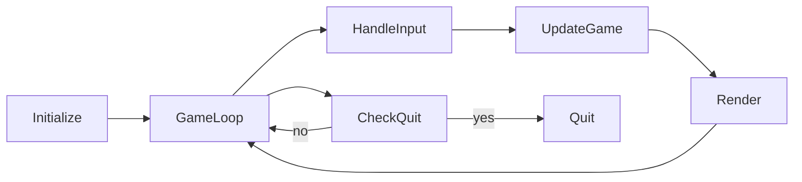

# README


$$f(x) = x * e^{2 pi i \xi x}$$


link to gitbook page with view-only access: https://app.gitbook.com/invite/uZMY4X7crbQgtQ2dZ2Rs/7x12vboA8OWTUKWTU25e

<figure><figcaption>
Logo of Temporary Poachers
</figcaption></figure>

Mermaid diagram test:

Slack link: https://join.slack.com/t/slack-vyg1374/shared\_invite/zt-2baitgfw7-zDMatwb7q8dpspR\~9mU6SQ
